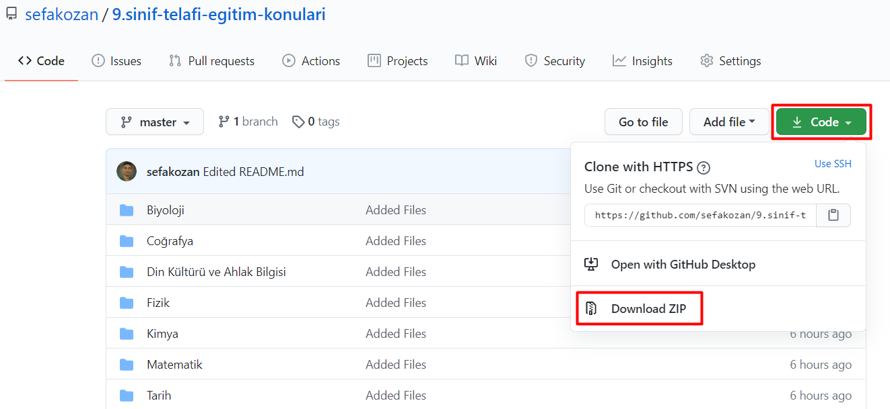

## 2019-2020 9.Sınıf 2. Dönem Telafi Eğitim Konuları
> 2019 - 2020 Eğitim Öğretim Yılının İkinci Dönemine ait Derslerin Kritik Konu ve Kazanımlarına Yönelik Öğretim Programları ve Etkinlik Örnekleri
 

Milli Eğitim Bakanlığı, yeni dönemde açılacak okullar öncesinde telafi eğitimlerinin yapılacağını açıkladı. Özel okullarda 15 Ağustos'ta başlayan telafi eğitimi, devlet okullarında 31 Ağustos'ta başlayacak. http://mufredat.meb.gov.tr/201920ikincidonem.html

## Telafi Konuları

  
<strong>Biyoloji</strong>

  * [Öğretim Programı](http://mufredat.meb.gov.tr/Dosyalar/TTKB/Lise/9/Biyoloji/biyoloji_9.pdf)
  * [Etkinlik Örneği 1](http://mufredat.meb.gov.tr/Dosyalar/TTKB/Lise/9/Biyoloji/c1-biyoloji-9.pdf)
  * [Etkinlik Örneği 2](http://mufredat.meb.gov.tr/Dosyalar/TTKB/Lise/9/Biyoloji/c2-biyoloji-9.pdf)

  
<strong>Coğrafya</strong>
 

  * [Öğretim Programı](http://mufredat.meb.gov.tr/Dosyalar/TTKB/Lise/9/Co%C4%9Frafya/cografya_9.pdf)
  * [Etkinlik Örneği 1](http://mufredat.meb.gov.tr/Dosyalar/TTKB/Lise/9/Co%C4%9Frafya/cografya_9.pdf)
  * [Etkinlik Örneği 2](http://mufredat.meb.gov.tr/Dosyalar/TTKB/Lise/9/Co%C4%9Frafya/c2-cografya-9.pdf)

  
<strong>Din Kültürü ve Ahlak Bilgisi</strong>

  * [Öğretim Programı](http://mufredat.meb.gov.tr/Dosyalar/TTKB/Lise/9/Din%20K%C3%BClt%C3%BCr%C3%BC%20ve%20Ahlak%20Bilgisi/dkab-9.pdf)
  * [Etkinlik Örneği ](http://mufredat.meb.gov.tr/Dosyalar/TTKB/Lise/9/Din%20K%C3%BClt%C3%BCr%C3%BC%20ve%20Ahlak%20Bilgisi/c1_dkab_9.pdf)

  
<strong>Fizik</strong>

  

  * [Öğretim Programı](http://mufredat.meb.gov.tr/Dosyalar/TTKB/Lise/9/Fizik/fizik_9.pdf)
  * [Etkinlik Örneği 1](http://mufredat.meb.gov.tr/Dosyalar/TTKB/Lise/9/Fizik/c1-fizik_9.pdf)
  * [Etkinlik Örneği 2](http://mufredat.meb.gov.tr/Dosyalar/TTKB/Lise/9/Fizik/c2-fizik_9.pdf)

  
<strong>İngilizce</strong>

  

  * [Öğretim Programı](http://mufredat.meb.gov.tr/Dosyalar/TTKB/Lise/9/%C4%B0ngilizce/ingilizce_9.pdf)
  * [Etkinlik Örneği 1](http://mufredat.meb.gov.tr/Dosyalar/TTKB/Lise/9/%C4%B0ngilizce/c1-ingilizce-9.pdf)
  * [Etkinlik Örneği 2](http://mufredat.meb.gov.tr/Dosyalar/TTKB/Lise/9/%C4%B0ngilizce/c2-ingilizce-9.pdf)

  
<strong>Kimya</strong>

  
  * [Öğretim Programı](http://mufredat.meb.gov.tr/Dosyalar/TTKB/Lise/9/Kimya/kimya_9.pdf)
  * [Etkinlik Örneği 1](http://mufredat.meb.gov.tr/Dosyalar/TTKB/Lise/9/Kimya/c1-kimya-9.pdf)
  * [Etkinlik Örneği 2](http://mufredat.meb.gov.tr/Dosyalar/TTKB/Lise/9/Kimya/c2-kimya-9.pdf)

  
<strong>Matematik</strong>

  
  * [Öğretim Programı](http://mufredat.meb.gov.tr/Dosyalar/TTKB/Lise/9/Matematik/matematik_9.pdf)
  * [Etkinlik Örneği 1](http://mufredat.meb.gov.tr/Dosyalar/TTKB/Lise/9/Matematik/c1-matematik_9.pdf)
  * [Etkinlik Örneği 2](http://mufredat.meb.gov.tr/Dosyalar/TTKB/Lise/9/Matematik/c2-matematik_9.pdf)

  
<strong>Tarih</strong>

  
  * [Öğretim Programı](http://mufredat.meb.gov.tr/Dosyalar/TTKB/Lise/9/Tarih/tarih_9.pdf)
  * [Etkinlik Örneği 1](http://mufredat.meb.gov.tr/Dosyalar/TTKB/Lise/9/Tarih/c1-tarih_9.pdf)
  * [Etkinlik Örneği 2](http://mufredat.meb.gov.tr/Dosyalar/TTKB/Lise/9/Tarih/c2_tarih_9.pdf)

  
<strong>Türk Dili ve Edebiyatı</strong>

  
  * [Öğretim Programı](http://mufredat.meb.gov.tr/Dosyalar/TTKB/Lise/9/T%C3%BCrk%20Dili%20ve%20Edebiyat%C4%B1/turkdiliedebiyati_9.pdf)
  * [Etkinlik Örneği 1](http://mufredat.meb.gov.tr/Dosyalar/TTKB/Lise/9/T%C3%BCrk%20Dili%20ve%20Edebiyat%C4%B1/c1-TDE_9.pdf)
  * [Etkinlik Örneği 2](http://mufredat.meb.gov.tr/Dosyalar/TTKB/Lise/9/T%C3%BCrk%20Dili%20ve%20Edebiyat%C4%B1/c2-TDE_9.pdf)

 
 

## Alakalı YouTube Videoları
* http://batmanodm.meb.gov.tr/www/lise-telafi-egitimi-videolari/icerik/47
* https://www.youtube.com/watch?v=i3MtJ3LGfa0&t=349s
* https://www.youtube.com/watch?v=mVGTnjNdSKs
* https://www.youtube.com/watch?v=tzS7Od2a-p4&t=7s
* https://www.youtube.com/watch?v=I4Gkux1edR0

 

## Bu PDF'leri Nasıl İndirebilirim?

> Sağ üst köşede bulunan `Code` kısmını kullanarak ZIP dosyası olarak indirebilirsiniz.

 

----
 

 

 